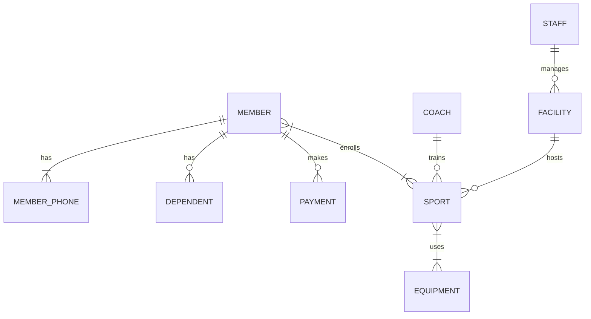

# Sports Club Database Schema & Architecture

This document provides a comprehensive breakdown of the database schema for the Sports Club Management System. The database has been rigorously designed using Entity-Relationship modeling and adheres strictly to the **Third Normal Form (3NF)** to guarantee zero redundancy and high data integrity.

---

## 1. Conceptual Design (Enhanced ERD)

The system relies on an Enhanced Entity-Relationship structure where a `PERSON` superclass generalizes the shared attributes for `MEMBER`, `COACH`, and `STAFF`.

---

## 2. Table Definitions (Logical Schema)

The database consists of **11 fully normalized tables**. Below is the exhaustive schema detailing column names, data types, and relational constraints.

### 2.1 Core Entities

#### `members`
Stores the primary details of club members.
*   **`member_id`** `INT (PK)`: Unique Auto-incrementing identifier.
*   **`name`** `VARCHAR(100)`: Full name of the member.
*   **`gender`** `ENUM('M', 'F')`: Gender specification.
*   **`dob`** `DATE`: Date of Birth.
*   **`city`** `VARCHAR(50)`: Address - City.
*   **`street`** `VARCHAR(100)`: Address - Street.
*   **`zip_code`** `VARCHAR(10)`: Address - ZIP Code.

#### `staff`
Stores employee records for club management.
*   **`staff_id`** `INT (PK)`: Unique Auto-incrementing identifier.
*   **`name`** `VARCHAR(100)`: Full name of the staff member.
*   **`gender`** `ENUM('M', 'F')`: Gender.
*   **`dob`** `DATE`: Date of birth.
*   **`role`** `VARCHAR(50)`: Job title/role (e.g., Manager, Maintenance).

#### `coaches`
Stores details of the trainers managing the sports.
*   **`coach_id`** `INT (PK)`: Unique Auto-incrementing identifier.
*   **`name`** `VARCHAR(100)`: Full name of the coach.
*   **`gender`** `ENUM('M', 'F')`: Gender.
*   **`dob`** `DATE`: Date of birth.
*   **`salary`** `DECIMAL(10,2)`: Coach's compensation.

#### `facilities`
Physical locations inside the club (e.g., Pool, Tennis Court).
*   **`fac_id`** `INT (PK)`: Unique Auto-incrementing identifier.
*   **`location`** `VARCHAR(100)`: Name/Location of the facility.
*   **`capacity`** `INT`: Maximum number of people allowed.
*   **`staff_id`** `INT (FK)`: References `staff.staff_id` (The manager in charge). *ON DELETE SET NULL*.

#### `sports`
Activities offered by the club.
*   **`sport_id`** `INT (PK)`: Unique Auto-incrementing identifier.
*   **`sport_name`** `VARCHAR(100)`: Name of the sport (e.g., Football).
*   **`fac_id`** `INT (FK)`: References `facilities.fac_id` (Where it is hosted). *ON DELETE SET NULL*.
*   **`coach_id`** `INT (FK)`: References `coaches.coach_id` (Who trains it). *ON DELETE SET NULL*.

#### `equipment`
Items used to play the sports.
*   **`equip_id`** `INT (PK)`: Unique Auto-incrementing identifier.
*   **`equip_name`** `VARCHAR(100)`: Name of the item.
*   **`condition_`** `VARCHAR(50)`: Current status (e.g., New, Good, Used).

---

### 2.2 Relational & Weak Entities (Composite Keys)

#### `dependents` (Weak Entity)
Family members associated with a primary club member.
*   **`member_id`** `INT (PK, FK)`: References `members.member_id`. *ON DELETE CASCADE*.
*   **`dep_name`** `VARCHAR(100) (PK)`: Name of the dependent.
*   **`relationship`** `VARCHAR(50)`: E.g., Son, Daughter, Wife.
*   **`dob`** `DATE`: Date of Birth.
> *Note: Primary Key is composite (`member_id`, `dep_name`).*

#### `member_phones` (Multi-valued Attribute)
Handles multiple phone numbers for a single member to satisfy 1NF.
*   **`member_id`** `INT (PK, FK)`: References `members.member_id`. *ON DELETE CASCADE*.
*   **`phone`** `VARCHAR(20) (PK)`: Phone number string.
> *Note: Primary Key is composite (`member_id`, `phone`).*

#### `payments` (1:N Relationship)
Financial transactions made by members.
*   **`pay_id`** `INT (PK)`: Unique transaction ID.
*   **`member_id`** `INT (FK)`: References `members.member_id`. *ON DELETE CASCADE*.
*   **`amount`** `DECIMAL(10,2)`: Amount paid.
*   **`pay_date`** `DATE`: Date of transaction.

---

### 2.3 Junction / Pivot Tables (M:N Relationships)

#### `enrolls` (Member <-> Sport)
Tracks which members are enrolled in which sports.
*   **`member_id`** `INT (PK, FK)`: References `members.member_id`.
*   **`sport_id`** `INT (PK, FK)`: References `sports.sport_id`.
*   **`enroll_date`** `DATE`: Date the member joined the sport.
> *Note: Primary Key is composite (`member_id`, `sport_id`). Both FKs use ON DELETE CASCADE.*

#### `uses` (Sport <-> Equipment)
Tracks which sports require which pieces of equipment.
*   **`sport_id`** `INT (PK, FK)`: References `sports.sport_id`.
*   **`equip_id`** `INT (PK, FK)`: References `equipment.equip_id`.
> *Note: Primary Key is composite (`sport_id`, `equip_id`). Both FKs use ON DELETE CASCADE.*

---

## 3. Normalization Strategy (1NF, 2NF, 3NF)

This database architecture satisfies all three major normalization forms:

1.  **First Normal Form (1NF) [Atomic Values]:**
    *   The member's address was decomposed into atomic columns (`city`, `street`, `zip_code`).
    *   The `phone` attribute was extracted into its own table (`member_phones`) to eliminate repeating groups.
    *   The `Age` attribute was intentionally excluded from the schema as it is a *derived* attribute that should be calculated dynamically from `dob`.
2.  **Second Normal Form (2NF) [No Partial Dependencies]:**
    *   All single-key tables trivially pass 2NF.
    *   For composite key tables like `enrolls(member_id, sport_id)`, the non-key attribute `enroll_date` relies entirely on the combination of BOTH keys (it represents *when* that specific member joined that specific sport), successfully eliminating partial dependencies.
3.  **Third Normal Form (3NF) [No Transitive Dependencies]:**
    *   Every non-key attribute depends *only* on the primary key, and nothing else. For instance, in the `facilities` table, the Foreign Key `staff_id` does not dictate the `location` or `capacity`. Therefore, no transitive dependencies exist.
